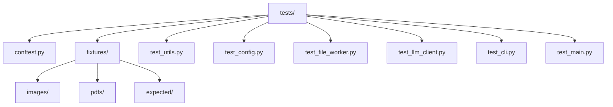

## 产品概述

完善 markpdfdown 项目的单元测试体系，重构测试目录结构，为所有核心模块编写完整的单元测试，确保代码质量和可维护性。

## 核心功能

- 重构测试目录结构，将测试数据文件移动到 `tests/fixtures/` 目录
- 为 `core/utils.py` 模块编写测试（remove_markdown_wrap、detect_file_type、validate_page_range）
- 为 `config.py` 模块编写测试（Config 类和 from_env 方法）
- 为 `core/file_worker.py` 模块编写测试（FileWorker、PDFWorker、ImageWorker、create_worker）
- 为 `core/llm_client.py` 模块编写测试（LLMClient，使用 mock 模拟 litellm 调用）
- 为 `cli.py` 模块编写测试（create_parser、validate_args）
- 为 `main.py` 模块编写测试（convert_to_markdown 等核心函数，使用 mock 模拟 LLM 调用）

## 技术栈

- 语言：Python 3.9+
- 测试框架：pytest 8.3.5
- Mock 库：unittest.mock（Python 标准库）
- 包管理：uv
- 代码规范：ruff

## 技术架构

### 系统架构

本项目采用 src layout 布局，测试代码位于 `tests/` 目录，与源码 `src/markpdfdown/` 并行。



### 模块划分

| 模块 | 职责 | 测试策略 |
| --- | --- | --- |
| utils.py | 工具函数 | 纯单元测试，无需 mock |
| config.py | 配置管理 | mock 环境变量 |
| file_worker.py | 文件处理 | mock PDF/图片操作 |
| llm_client.py | LLM 客户端 | mock litellm.completion |
| cli.py | 命令行接口 | 测试参数解析和验证 |
| main.py | 核心转换逻辑 | mock LLMClient 和 FileWorker |


### 数据流


## 实现细节

### 核心目录结构

```
tests/
├── __init__.py
├── conftest.py              # pytest 配置和共享 fixtures
├── test_utils.py            # utils.py 测试
├── test_config.py           # config.py 测试
├── test_file_worker.py      # file_worker.py 测试
├── test_llm_client.py       # llm_client.py 测试
├── test_cli.py              # cli.py 测试
├── test_main.py             # main.py 测试
└── fixtures/                # 测试数据目录
    ├── images/              # 测试图片
    │   ├── demo_01.png
    │   ├── demo_02.png
    │   ├── markpdfdown.png
    │   ├── formula_01.png
    │   └── table_01.png
    ├── pdfs/                # 测试 PDF
    │   └── input_tables.pdf
    └── expected/            # 期望输出
        ├── formula_01.md
        └── table_01.md
```

### 关键代码结构

**conftest.py - 共享 Fixtures**：提供测试所需的共享 fixtures，包括测试文件路径、mock 对象和临时目录管理。

```python
import pytest
import os

@pytest.fixture
def fixtures_dir():
    """返回 fixtures 目录路径"""
    return os.path.join(os.path.dirname(__file__), "fixtures")

@pytest.fixture
def sample_image_path(fixtures_dir):
    """返回示例图片路径"""
    return os.path.join(fixtures_dir, "images", "demo_01.png")

@pytest.fixture
def sample_pdf_path(fixtures_dir):
    """返回示例 PDF 路径"""
    return os.path.join(fixtures_dir, "pdfs", "input_tables.pdf")

@pytest.fixture
def mock_llm_response():
    """返回模拟的 LLM 响应"""
    return "# Sample Markdown\n\nThis is a test response."
```

**LLMClient Mock 策略**：使用 unittest.mock 模拟 litellm.completion 调用，避免实际 API 请求。

```python
from unittest.mock import patch, MagicMock

@pytest.fixture
def mock_litellm():
    """Mock litellm.completion"""
    with patch("markpdfdown.core.llm_client.completion") as mock:
        mock_response = MagicMock()
        mock_response.choices = [MagicMock()]
        mock_response.choices[0].message.content = "# Mocked Response"
        mock.return_value = mock_response
        yield mock
```

### 技术实现方案

#### 1. utils.py 测试

- **remove_markdown_wrap**: 测试正常移除、无包装文本、空文本、不同语言标识
- **detect_file_type**: 测试 PDF、JPEG、PNG、BMP、GIF、未知类型
- **validate_page_range**: 测试正常范围、边界值、异常情况

#### 2. config.py 测试

- **Config 类**: 测试默认值、自定义值、值验证
- **from_env**: 使用 monkeypatch 模拟环境变量

#### 3. file_worker.py 测试

- **ImageWorker**: 测试初始化和 convert_to_images 方法
- **PDFWorker**: mock PyPDF2 和 fitz，测试页面范围处理
- **create_worker**: 测试工厂函数的文件类型分发

#### 4. llm_client.py 测试

- **LLMClient.completion**: mock litellm，测试消息构建、重试机制、错误处理
- **_encode_image**: 测试 base64 编码

#### 5. cli.py 测试

- **create_parser**: 测试参数解析
- **validate_args**: 测试参数验证逻辑和错误处理

#### 6. main.py 测试

- **convert_image_to_markdown**: mock LLMClient
- **convert_to_markdown**: mock create_worker 和 LLMClient
- **convert_from_file**: mock 文件读取和转换逻辑

## 技术考量

### 测试隔离

- 每个测试独立运行，使用 fixtures 管理状态
- 使用 tmp_path fixture 处理临时文件
- 确保 mock 在测试后正确清理

### 测试覆盖

- 目标：核心模块 80%+ 覆盖率
- 测试正常路径和边界情况
- 测试异常处理和错误消息